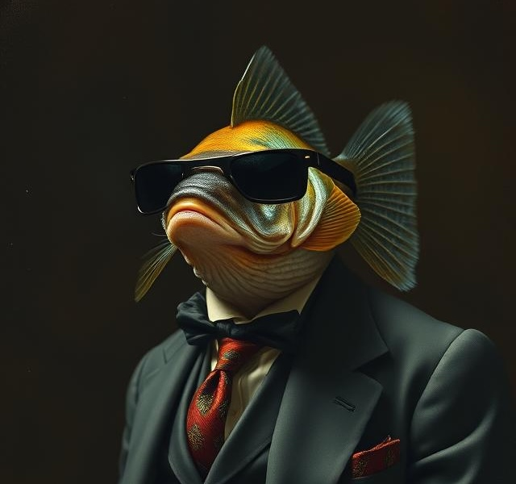

# GPY: Guppy Prompt, Yay!

Terminal prompt for Bash, Fish, and Zsh, powered by a background agent.

<p align="center">
  
</p>

[](https://github.com/jpease/gpy/actions/workflows/cross-platform-test.yml)
[](https://www.gnu.org/licenses/gpl-3.0)

<p align="center">
  
</p>

## Why GPY

- Tries to be fairly fast
- Live updates via async agent
- Smart language detection with confidence-based filtering
- Custom theme support, including importing an existing Starship `starship.toml`
- Custom palette support, including importing [tinted-theming](https://github.com/tinted-theming/schemes) base16/base24 color schemes

## Install

### One-line install (recommended)

```bash
curl -sS https://raw.githubusercontent.com/jpease/gpy/main/install-oneline.sh | sh
```

After install:

```bash
exec fish  # or: exec zsh / exec bash
```

The installer verifies every binary against the SHA-256 checksum published
with the release and aborts if it cannot. To check a download yourself, or to
verify the build provenance attestation, see
[Verifying Your Download](docs/INSTALL.md#verifying-your-download).

### Icons and Nerd Fonts

GPY's full look uses [Nerd Font](https://www.nerdfonts.com) glyphs. To avoid a
first prompt full of `□`/`?` boxes on a machine without one, the installer runs
`gpy-agent init`, which picks an icon style that renders where you are:

- If a Nerd Font is detected (and, when a terminal is attached, you confirm the
  sample glyphs render), icons stay **on** (`ui.show_icons = true`).
- If no Nerd Font is detected — or detection is inconclusive — GPY defaults to
  **ASCII** icons, which render on any terminal.

An existing config is never overwritten, so upgrades keep your settings. To
switch styles at any time:

```bash
gpy config set ui.show_icons true    # full Nerd Font glyphs
gpy config set ui.show_icons false   # ASCII fallback
```

Force a choice non-interactively (e.g. in provisioning scripts) with the
`GPY_NERD_FONT` environment variable (`1`/`nerd`, `0`/`none`, or `unknown`);
when it is set, `gpy-agent init` skips the confirmation prompt entirely.

### From source

Needs Rust (the `rust-version` in `gpy-agent/Cargo.toml`) and Fish:

```bash
git clone https://github.com/jpease/gpy.git
cd gpy
fish install-dev.fish
```

That builds the agent, installs `gpy-agent` and `gpy` into `~/.local/bin`, and
wires up the Fish integration. For Zsh or Bash, build with `cargo build
--release` and follow the per-shell steps in
[Building from Source](docs/INSTALL.md#building-from-source). `install.sh` is
the release-archive installer: it needs the checksummed `bin/` payload that a
release tarball carries and a checkout does not.

## Quick commands

```bash
gpy status
gpy doctor
gpy theme list
gpy segments
gpy theme import ~/.config/starship.toml   # import an existing Starship config
gpy palette import scheme.yaml             # import a base16/base24 color scheme
```

Tab-completion for `gpy` (subcommands, flags, and live theme/palette/segment names) is set up automatically for fish, bash, and zsh.

## Documentation

- [Installation Guide](docs/INSTALL.md) — see [Supported Platforms and Shells](docs/INSTALL.md#supported-platforms-and-shells) for the canonical OS/shell support matrix
- [User Docs](docs/user/README.md)
- [CLI Reference](docs/user/cli-reference.md)
- [Advanced Configuration](docs/user/advanced-configuration.md)
- [Bash Limitations](docs/user/bash-limitations.md)
- [Developer Docs](docs/dev/README.md)
- [Competitive Comparison](docs/COMPETITIVE_COMPARISON.md)

## Development

```bash
./scripts/quality-check.sh
just test
```

See [CONTRIBUTING.md](CONTRIBUTING.md) for contributor workflow and standards.

## License

GPL-3.0-or-later. See [LICENSE](LICENSE).
