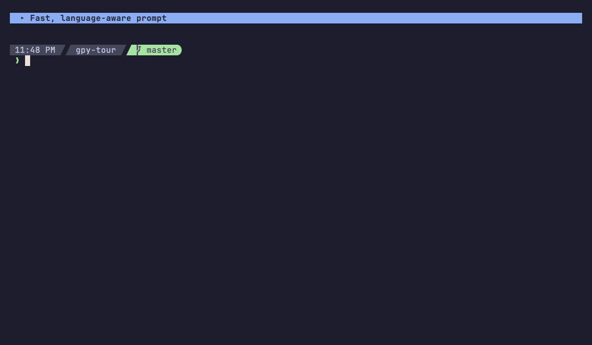

# GPY: Guppy Prompt, Yay!

A shell prompt for Fish, Zsh, and Bash. A background agent computes git status
and language detection and caches the result, so most prompts draw from the
cache and the agent repaints them when something changes.

<p align="center">
  
</p>

[](https://www.gnu.org/licenses/gpl-3.0)

GPY is at version 0.1.0. It runs on macOS and Linux, and on Windows through WSL.
Bash has [some limitations](docs/user/bash-limitations.md). Full matrix:
[Supported Platforms and Shells](docs/INSTALL.md#supported-platforms-and-shells).

## Features

- Cached prompts draw without waiting. A stale entry shows at once and the agent
  repaints it when the update is ready. The first prompt in a repository waits
  up to 150 ms for git status; language detection never blocks.
- Language detection by file content, project markers, or both; show every
  language found, the main one, or the top N.
- Themes, including import of an existing Starship `starship.toml`.
- Palettes, including import of [tinted-theming](https://github.com/tinted-theming/schemes)
  base16/base24 schemes.

## Install

The [Installation Guide](docs/INSTALL.md) covers every method, installer
options, manual installation, troubleshooting, and uninstalling.

### One-line install

```bash
curl -sS https://raw.githubusercontent.com/jpease/gpy/main/install-oneline.sh | sh
exec fish  # or: exec zsh / exec bash
```

The installer checks each binary against the release's SHA-256 checksum and
stops on a mismatch. To check a download yourself, see
[Verifying Your Download](docs/INSTALL.md#verifying-your-download).

GPY uses [Nerd Font](https://www.nerdfonts.com) icons when it finds a Nerd Font
and ASCII icons otherwise. Switch with `gpy config set ui.show_icons true` (or
`false`); see [Icons and Nerd Fonts](docs/INSTALL.md#icons-and-nerd-fonts).

### From source

Needs Rust 1.98+ and Fish:

```bash
git clone https://github.com/jpease/gpy.git
cd gpy
fish install-dev.fish
```

For Zsh or Bash, see [Building from Source](docs/INSTALL.md#building-from-source).

## Usage

```bash
gpy status                                # agent status and diagnostics
gpy doctor                                # health checks
gpy theme list
gpy theme import ~/.config/starship.toml --name my-prompt
gpy palette import scheme.yaml
```

Tab completion for `gpy` is installed for all three shells.

## Documentation

- [Installation Guide](docs/INSTALL.md)
- [User guide](docs/user/README.md), [CLI reference](docs/user/cli-reference.md),
  and [Advanced Configuration](docs/user/advanced-configuration.md)
- [Migrating from Starship](docs/user/migrating-from-starship.md)
- [How GPY compares](docs/COMPETITIVE_COMPARISON.md)
- [Developer docs](docs/dev/README.md)

## Contributing

See [CONTRIBUTING.md](CONTRIBUTING.md). `./scripts/quality-check.sh` runs the full gate.

## License

GPL-3.0-or-later. See [LICENSE](LICENSE).
